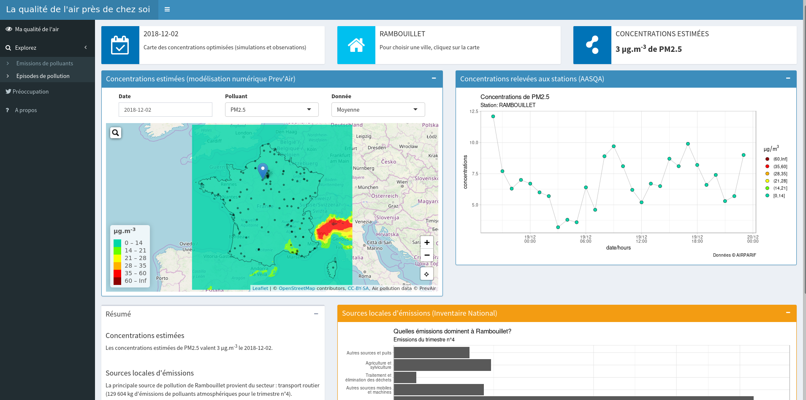

```{r setup, include=FALSE}
knitr::opts_chunk$set(echo = TRUE)
```

## Présentation du projet

Cette application (réalisée pour le [concours](https://www.lcsqa.org/sites/default/files/Actualit%C3%A9s/A6-2018-09-REGLEMENT%20CONCOURS%20QA%20v03092018.pdf) sur __la valorisation des données relatives à la qualité de l'air extérieur__ proposé par le [ministère de la transition écologique et solidaire](https://www.ecologique-solidaire.gouv.fr/)), **la qualité de l'air près de chez soi**, a été créée dans le but de permettre à l'utilisateur de **s'informer sur la qualité de l'air près de chez lui et d'explorer les sources de pollution de sa commune.** Elle se base sur de nombreuses sources de données (Prev'Air, LCSA, INS...) et une interface simple et interactive. 

L'application est un outil permettant d'explorer de nombreuses données relatives à la qualité de l'air :

- Estimation des concentrations de polluants atmosphériques par [Prev'Air](http://www2.prevair.org/)
- Mesures des concentrations de polluants atmopshériques par les [AASQA](https://atmo-france.org/)
- Liste des épisodes de pollution par le [LCSQA](https://www.lcsqa.org/fr)
- Emissions de polluants par secteur par l'[INS](http://emissions-air.developpement-durable.gouv.fr/)

L'application a été développée pour permettre une exploration de la qualité de l'air au niveau de la commune mais surtout pour permettre aux utilisateurs d'étudier les sources locales de pollution et, peut-être, donner l'envie à certains utilisateurs de modifier leurs habitudes lorsqu'ils découvriront par exemple que le trafic est un secteur d'émissions majeur dans leur commune. 

L'idée étant de proposer en première page (figure ci-après) un aperçu de la qualité de l'air (carte et mesure) et une figure montrant les sources de pollution principale pour la commune choisie qui donne ensuite envie à l'utilisateur d'en explorer les détails. La découverte des sources de pollution mais aussi des épisodes de pollution en France et dans le département font l'objet de pages à part entière composées de graphiques interactifs qui permettent par exemple de changer la zone étudiée, faire varier les années... De plus un onglet porte sur une étude de tendance des recherches de qualité de l'air en France et sur une collecte d'un mois de tweets relatifs à la pollution atmosphérique et au changement climatique afin d'estimer l'intérêt des gens pour la qualité de l'air. Enfin une dernière page explique le pourquoi de l'application, détaille les données utilisées et leur provenance, donne des éléments de réponse sur la qualité de l'air mais surtout oriente l'utilisateur vers des sources d'informations (ministère, Prev'Air, AASQA...).

{ width=100% }


## Sources des données et software utilisé 

L'ensemble des données est accessible librement sur les sites des fournisseurs de données (détaillé ci-après) et les traitements de données et l'application ont tous été réalisés avec le logiciel libre R et des packages additionnels. 

### Provenance des données utilisées 

- __Modélisation de la qualité de l'air (Prev'Air)__: [ici](https://www.data.gouv.fr/fr/datasets/mise-a-disposition-de-donnees-de-qualite-de-lair-sur-la-france-www-prevair-org-1/#_)
- __Mesures de la qualité de l'air (AASQA)__: [ici](https://www.data.gouv.fr/fr/datasets/donnees-temps-reel-de-mesure-des-concentrations-de-polluants-atmospheriques-reglementes-1/) ou [ici](http://discomap.eea.europa.eu/))
- __Dépassement de seuils (LCSQA)__: [ici](
https://www.lcsqa.org/fr/vigilance-atmospherique/episodes/liste)
- __Inventaire d'émissions (INS)__: [ici](http://emissions-air.developpement-durable.gouv.fr/)
- __Shapefiles (DataGouv)__: [contour France](https://www.data.gouv.fr/fr/)...

### Liste des packages [R (version 3.5.2)](https://cran.r-project.org/) utilisés au cours du projet

- __Collecte de données__
  - [gtrendsR](https://github.com/PMassicotte/gtrendsR): collecte d'une partie des données Google Trends
  - [rtweet](https://rtweet.info/): collecte et exploitation des données Twitter
- __Traitement de données & visualisation__
  - [tidyverse](https://www.tidyverse.org/): lecture, traitement & manipulation de données (readxl, readr, dplyr, tibble, tidyr & purrr) et visualisation (ggplot2 & scales)
  - [sf](https://r-spatial.github.io/sf/): shapefiles et calcul de distance...
  - [rgdal](https://cran.r-project.org/web/packages/rgdal/index.html): lecture d'un shapefile (problème avec sf?)
  - [rmapshaper](https://cran.r-project.org/web/packages/rmapshaper/index.html): simplifier les contours des shapefiles
  - [raster](https://cran.r-project.org/web/packages/raster/index.html) (& [ncdf4](https://cran.r-project.org/web/packages/ncdf4/index.html)): concentrations modélisées sous forme de netcdf (Prev'Air)
- __Application web & reporting__
  - [shiny](https://shiny.rstudio.com/)
  - [shinydashboard](https://rstudio.github.io/shinydashboard/)
  - [shinyWidgets](https://github.com/dreamRs/shinyWidgets)
  - [leaflet](https://rstudio.github.io/leaflet/) & [leaflet.extras](https://bhaskarvk.github.io/leaflet.extras/)
  - [rmarkdown](https://rmarkdown.rstudio.com/index.html): rédaction de rapport, de la partie préoccupation et à propos dans l'application...

## Améliorations à implémenter

Quelques idées d'améliorations à intégrer à l'application classées par catégorie:

- __Mise en production__
  - requêtes de données journalières
  - déploiement de l'application sur serveur privé (pas de problème de mémoire) ou shinyapps.io (décider où stocker les données)
- __Améliorer l'expérience utilisateur__
  - travailler le design et l'interface utilisateur (simplicité, couleurs & ergonomie)
  - ajouter une option débuter un tour de l'application qui met en évidence les principales fonctionnalités?
  - ajout de valeurs annuelles pour aider l'utilisateur à se situer
- __Ajout de données__
  - intégrer les DOMTOM dans l'outil (seul les mesures sont disponibles)
  - ajouter les prévisions Europe (Copernicus) et régionales (AASQA)
  - intégrer d'autres espèces et plus de sources (SNAP2 et 3) dans l'analyse des sources de pollution
  - collecte de données twitter sur une période plus significative (plus tweets en anglais)...
- __Structure du code__
  - travailler la modularité (notamment pour les grahiques) 
  - utiliser les nouvelles fonctionnalités shiny pour gagner en vitesse (cache pour les plot & chargement async des données notamment les émissions)
  - ajouter des graphiques?


