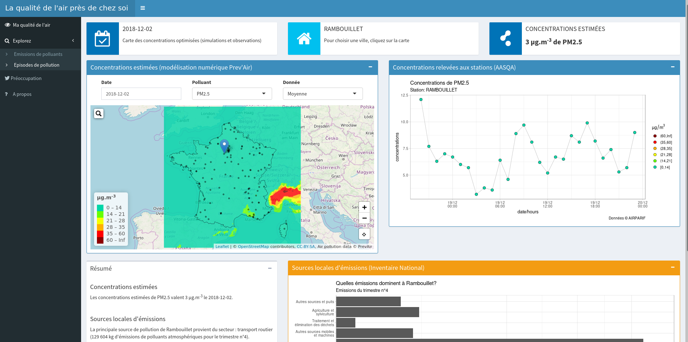

La qualité de l’air près de chez soi
================

## Présentation du projet

Cette application (réalisée pour le
[concours](https://www.lcsqa.org/sites/default/files/Actualit%C3%A9s/A6-2018-09-REGLEMENT%20CONCOURS%20QA%20v03092018.pdf)
sur **la valorisation des données relatives à la qualité de l’air
extérieur** proposé par le [ministère de la transition écologique et
solidaire](https://www.ecologique-solidaire.gouv.fr/)), **la qualité de
l’air près de chez soi**, a été créée dans le but de permettre à
l’utilisateur de **s’informer sur la qualité de l’air près de chez lui
et d’explorer les sources de pollution de sa commune.** Elle se base sur
de nombreuses sources de données (Prev’Air, LCSA, INS…) et une interface
simple et interactive.

L’application est un outil permettant d’explorer de nombreuses données
relatives à la qualité de l’air :

  - Estimation des concentrations de polluants atmosphériques par
    [Prev’Air](http://www2.prevair.org/)
  - Mesures des concentrations de polluants atmopshériques par les
    [AASQA](https://atmo-france.org/)
  - Liste des épisodes de pollution par le
    [LCSQA](https://www.lcsqa.org/fr)
  - Emissions de polluants par secteur par
    l’[INS](http://emissions-air.developpement-durable.gouv.fr/)

L’application a été développée pour permettre une exploration de la
qualité de l’air au niveau de la commune mais surtout pour permettre aux
utilisateurs d’étudier les sources locales de pollution et, peut-être,
donner l’envie à certains utilisateurs de modifier leurs habitudes
lorsqu’ils découvriront par exemple que le trafic est un secteur
d’émissions majeur dans leur commune.

L’idée étant de proposer en première page (figure ci-après) un aperçu de
la qualité de l’air (carte et mesure) et une figure montrant les sources
de pollution principale pour la commune choisie qui donne ensuite envie
à l’utilisateur d’en explorer les détails. La découverte des sources de
pollution mais aussi des épisodes de pollution en France et dans le
département font l’objet de pages à part entière composées de
graphiques interactifs qui permettent par exemple de changer la zone
étudiée, faire varier les années… De plus un onglet porte sur une étude
de tendance des recherches de qualité de l’air en France et sur une
collecte d’un mois de tweets relatifs à la pollution atmosphérique et au
changement climatique afin d’estimer l’intérêt des gens pour la qualité
de l’air. Enfin une dernière page explique le pourquoi de l’application,
détaille les données utilisées et leur provenance, donne des éléments de
réponse sur la qualité de l’air mais surtout oriente l’utilisateur vers
des sources d’informations (ministère, Prev’Air, AASQA…).

## Sources des données et software utilisé

L’ensemble des données est accessible librement sur les sites des
fournisseurs de données (détaillé ci-après) et les traitements de
données et l’application ont tous été réalisés avec le logiciel libre R
et des packages additionnels.

### Provenance des données utilisées

  - **Modélisation de la qualité de l’air (Prev’Air)**:
    [ici](https://www.data.gouv.fr/fr/datasets/mise-a-disposition-de-donnees-de-qualite-de-lair-sur-la-france-www-prevair-org-1/#_)
  - **Mesures de la qualité de l’air (AASQA)**:
    [ici](https://www.data.gouv.fr/fr/datasets/donnees-temps-reel-de-mesure-des-concentrations-de-polluants-atmospheriques-reglementes-1/)
    ou [ici](http://discomap.eea.europa.eu/))
  - **Dépassement de seuils (LCSQA)**:
    [ici](https://www.lcsqa.org/fr/vigilance-atmospherique/episodes/liste)
  - **Inventaire d’émissions (INS)**:
    [ici](http://emissions-air.developpement-durable.gouv.fr/)
  - **Shapefiles (DataGouv)**: [contour
    France](https://www.data.gouv.fr/fr/)…

### Liste des packages [R (version 3.5.2)](https://cran.r-project.org/) utilisés au cours du projet

  - **Collecte de données**
      - [gtrendsR](https://github.com/PMassicotte/gtrendsR): collecte
        d’une partie des données Google Trends
      - [rtweet](https://rtweet.info/): collecte et exploitation des
        données Twitter
  - **Traitement de données & visualisation**
      - [tidyverse](https://www.tidyverse.org/): lecture, traitement &
        manipulation de données (readxl, readr, dplyr, tibble, tidyr &
        purrr) et visualisation (ggplot2 & scales)
      - [sf](https://r-spatial.github.io/sf/): shapefiles et calcul de
        distance…
      - [rgdal](https://cran.r-project.org/web/packages/rgdal/index.html):
        lecture d’un shapefile (problème avec
        sf?)
      - [rmapshaper](https://cran.r-project.org/web/packages/rmapshaper/index.html):
        simplifier les contours des
        shapefiles
      - [raster](https://cran.r-project.org/web/packages/raster/index.html)
        (&
        [ncdf4](https://cran.r-project.org/web/packages/ncdf4/index.html)):
        concentrations modélisées sous forme de netcdf (Prev’Air)
  - **Application web & reporting**
      - [shiny](https://shiny.rstudio.com/) &
        [shinydashboard](https://rstudio.github.io/shinydashboard/) :
        construction de l’application
      - [shinyWidgets](https://github.com/dreamRs/shinyWidgets) :
        certaines fonctions de l’application
      - [leaflet](https://rstudio.github.io/leaflet/) &
        [leaflet.extras](https://bhaskarvk.github.io/leaflet.extras/) :
        carte interactive des concentrations
      - [rmarkdown](https://rmarkdown.rstudio.com/index.html): rédaction
        de rapport, de la partie préoccupation et à propos dans
        l’application…

## Améliorations à implémenter

Quelques idées d’améliorations à intégrer à l’application classées par
catégorie:

  - **Mise en production**
      - requêtes de données journalières
      - déploiement de l’application sur serveur privé (pas de problème
        de mémoire) ou shinyapps.io (décider où stocker les données)
  - **Améliorer l’expérience utilisateur**
      - travailler le design et l’interface utilisateur (simplicité,
        couleurs & ergonomie)
      - ajouter une option débuter un tour de l’application qui met en
        évidence les principales fonctionnalités?
      - ajout de valeurs annuelles pour aider l’utilisateur à se situer
  - **Ajout de données**
      - intégrer les DOMTOM dans l’outil (seules les mesures sont
        disponibles)
      - ajouter les prévisions Europe (Copernicus) et régionales (AASQA)
      - intégrer d’autres espèces et plus de sources (SNAP2 et 3) dans
        l’analyse des sources de pollution
      - collecte de données twitter sur une période plus significative
        (plus tweets en anglais)…
  - **Structure du code**
      - travailler la modularité (notamment pour les grahiques)
      - utiliser les nouvelles fonctionnalités shiny pour gagner en
        vitesse (cache pour les plot & chargement async des données
        notamment les émissions)
      - ajouter des graphiques?
