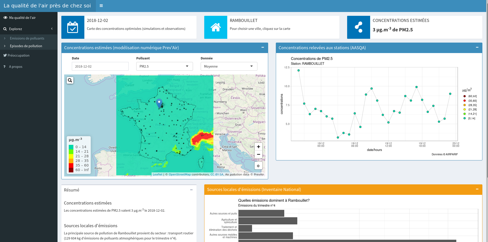

## Introduction

Cette application, **la qualité de l'air près de chez soi**, a été créée dans le but de permettre à l'utilisateur de **s'informer sur la qualité de l'air près de chez lui et d'explorer les sources de pollution de sa commune.** Elle se base sur de nombreuses sources de données (AASQA, Prev'Air, LCSA et INS) et une interface simple et interactive. Pour voir une présentation interactive de l'application, veuillez suivre ce [lien](https://drive.google.com/open?id=1b7IRsnLc-p-_0ob0SHqSIwnmDzdkk5MJ) ou télécharger la courte vidéo dans le dossier reporting. 

## Démarche

Comme évoqué dans l'introduction, l'application est un outil permettant d'explorer de nombreuses données relatives à la qualité de l'air :

- Estimation des concentrations de polluants atmosphériques par Prev'Air 
- Mesures des concentrations de polluants atmopshériques par les AASQA
- Liste des épisodes de pollution par le LCSQA
- Emissions de polluants par secteur par l'INS

L'application a été développée pour permettre une exploration de la qualité de l'air au niveau de la commune mais surtout pour permettre aux utilisateurs d'étudier les sources locales de pollution et, peut-être, donner l'envie à certains utilisateurs de modifier leurs habitudes lorsqu'ils découvriront par exemple que le trafic est un secteur d'émissions majeur dans leur commune. 

L'idée étant de proposer en première page (figure ci-après) un aperçu de la qualité de l'air (carte et mesure) et une figure montrant les sources de pollution principale pour la commune choisie qui donne ensuite envie à l'utilisateur d'en explorer les détails. La découverte des sources de pollution mais aussi des épisodes de pollution en France et dans le département font l'objet de pages à part entière composées de graphiques interactifs qui permettent par exemple de changer la zone étudiée, faire varier les années... De plus un onglet porte sur une étude de tendance des recherches de qualité de l'air en France et sur une collecte d'un mois de tweets relatifs à la pollution atmosphérique et au changement climatique afin d'estimer l'intérêt des gens pour la qualité de l'air. Enfin une dernière page explique le pourquoi de l'application, détaille les données utilisées et leur provenance, donne des éléments de réponse sur la qualité de l'air mais surtout oriente l'utilisateur vers des sources d'informations (ministère, Prev'Air, AASQA...).

{ width=100% }

## Exploitation des données

Dans cette section le traitement des données ainsi que quelques choix d'implémentations importants sont détaillés. L'ensemble du code est disponible sur [github](https://github.com/lemairev/aq-mtes) avec notamment les scripts de traitement de données dans le dossier ```preproc```. Certains traitements sont réalisés au sein même de l'application (scripts ```server.R``` et ```global.R```) si nécessaires. 

### Traitement des données

L'ensemble des traitements de données ainsi que la conception de l'application ont été réalisés à l'aide du logiciel [R](https://www.r-project.org/). De nombreux packages ont été utilisés tant pour la collecte et le traitement de données que pour la création de l'application elle-même. L'ensemble de ces packages est détaillé dans le ```README```.

Les différentes sources de données exploitées dans l'application ont déjà été évoquées (Prev'Air, AASQA, LCSQA, INS). Les données ont été collectées sur les sites respectifs des institutions ou sur [DataGouv](https://www.data.gouv.fr/fr/). Seules les concentrations mesurées par les AASQA ont été collectées par le biais de l'_Environmental European Agency_ afin de pouvoir facilement étendre le domaine à l'Europe. Les liens vers les sources de données sont aussi rappelés dans le ```README```.

De nombreuses opérations de traitement de données ont été réalisées avec notamment un travail de fond important sur le fichier historique des épisodes de pollution du LCSQA qui contient des colonnes avec plusieurs éléments dedans (script ```lcsqa_episodes.R```). Un autre travail fastidieux a été de pouvoir faire correspondre l'ensemble des données "d'un point de vue géographique" avec notamment les correspondances anciennes, nouvelles régions, les noms de département et régions qui n'étaient pas forcément écrits de la même façon et qui pouvaient être sans code (donc plus difficile à faire correspondre; scripts ```corresp_*.R```). En plus de ces différents traitements, les données de l'inventaire national spatialisé ont été agrégées à diverses échelles et les fractions de particules ont été calculées afin d'obtenir par exemple la fraction de PM2.5, de PM10 - PM2.5 et de TSP - PM10 (scripts ```ins_*.R```). Les données issues de Twitter ont aussi demandé un travail de nettoyage assez important, notamment à cause des accents (scripts de collecte dans le dossier ```preproc/fetch_tweetair``` et de traitement ```reporting/social.Rmd```).

Enfin, tout au long du développement de l'application, un soin particulier a été apporté à la vitesse d'exécution afin que l'utilisateur ne soit pas découragé par la lenteur d'affichage des graphiques, cartes et des calculs engendrés par ses actions.

### Choix d'implémentation

Au cours du développement de l'application et de la réalisation des traitements de données de nombreux choix d'implémentation ont été réalisés. Ce paragraphe présente quelques choix importants. 

Lors du "prototypage" de l'application, les données ont été limitées à la France Métropolitaine puisque les projections de qualité de l'air sont réalisées uniquement sur la métropole à la différence des mesures... La collecte des mesures de qualité de l'air par le biais de l'agence européenne de l'environnement permet aussi de collecter en une fois l'ensemble des stations (au lieu de faire des requêtes par région) et de facilement étendre au domaine Européen. Cependant, afin d'utiliser des produits régionaux des AASQA comme les inventaires d'émissions ou données sur l'exposition des populations, il conviendrait de faire des requêtes directement sur leurs API respectives. L'utilisation de ces données reste à implémenter et sera évoquée dans la partie d'adaptation à d'autres jeux de données (section ci-après). Enfin un dernier choix important concerne la collecte des tweets et les requêtes Google Trends. Là encore, les tweets ont été collectés en Français uniquement et les requêtes de recherches sur Google concernaient uniquement le territoire français. Des pistes sont évoquées pour améliorer et compléter ces choix. 

En somme, l'idée était de bâtir un prototype fonctionnel et adaptable. De cette façon, le code pourrait s'adapter simplement à d'autres jeux de données, intégrer de nouvelles figures...  

## Utilisation du code

Cette section décrit les capacités d'adaptation du code à d'autres jeux de données ainsi que les prérequis techniques pour développer l'application, la déployer et l'utiliser.

### Adaptation à d'autres données

Comme évoqué en amont, différents choix d'implémentations ont conduit à ne pas exploiter l'ensemble des données mises à disposition dans un premier temps. Cependant, l'emploi d'autres données apporterait un plus indéniable à l'application, notamment en utilisant les produits des AASQA qui ont une résolution plus fine et/ou étendre le domaine à l'Europe (voir la section perspective). 

Le code permet assez simplement d'intégrer un nouveau jeu de données. Il faut juste s'assurer de la correspondance entre les noms des polluants, du type de format des fichiers (par exemple netcdf pour les prévisions quotidiennes) et le cas échéant adapter la lecture du fichier dans le code. Pour le moment, les données de mesures lues sont formatées pour le reporting Européen donc agrandir le domaine à l'Europe ne devrait pas poser de problèmes. Il suffirait de collecter l'ensemble des stations ainsi que les prévisions européenes (sous forme netcdf comme PrevAir) et d'intégrer une option où l'on sélectionne l'étendue spatiale souhaitée (France ou Europe). 

Concernant l'utilisation de données régionales des AASQA, il faudrait faire des requêtes sur les différentes API selon la région souhaitée et, là encore, modifier le code de façon à ce qu'il accepte le format d'entrée des données, s'assurer que les noms de polluants concordent et normalement le code devrait fonctionner. 

En somme, ajouter de nouvelles sources de données demande certains petits ajustements si le format change. De façon à rendre le code encore plus souple et adaptable, il pourrait être retravaillé sous forme de module. Chaque module a une tâche précise et serait "auto-suffisant". En plus de permettre une meilleure adaptation, cela permettrait à plusieurs développeurs de travailler en même temps sur l'application, chacun développant son module.

### Prérequis techniques

Les prérequis techniques relatifs au développement, déploiement (administrateur) et utilisation de l'application sont détaillés (utilisateur). 

Tout d'abord, pour prendre en main et développer l'application il faut uniquement connaître R ou souhaiter apprendre à l'utiliser. L'installation de R et des packages utilisés dépendent de l'environnement (Windows, Linux, Mac) mais de nombreux tutoriels existent pour vous guider ainsi qu'une communauté importante d'utilisateurs. Concernant le déploiement de l'application sur le web, selon le type d'implémentation certaines parties nécessiteront un développement additionnel. Ici deux solutions sont proposées pour déployer l'application: 

- __Sur son propre serveur :__ l'avantage de cette solution réside dans la limitation en mémoire moins restrictive que sur un serveur payant. Il reste à implémenter les requêtes journalières de données de qualité de l'air (mesures, simulations et épisodes) pour que l'application fonctionne "seule". L'inconvénient majeur est qu'il faut administrer le serveur.
- __Sur un [serveur payant](https://shiny.rstudio.com/deploy/) du type shinyapps.io :__ l'avantage principal est que l'application est juste déposée sur le serveur sans avoir besoin d'administrer son propre serveur. Cependant cela a un coût et la mémoire est plus limitée que sur son propre serveur. Il convient donc de développer les requêtes journalières de données et de trouver un stockage additionnel (type dropbox ou autre) pour ces mêmes données et de retravailler l'import des données dans l'application comme [cela](https://shiny.rstudio.com/articles/persistent-data-storage.html) par exemple. 

Enfin d'un point de vue utilisateur, une fois l'application sur internet, celle-ci est accessible depuis le navigateur internet d'un ordinateur ou d'un smartphone. Elle est conçue de façon à s'adapter à l'écran de l'utilisateur pour une meilleure navigation. 

## Limites et perspectives

La principale limite de cette application est qu'elle s'applique uniquement à la France métropolitaine. Cela a été fait dans un but de cohérence puisque les simulations de prévision de qualité de l'air sont uniquement réalisées sur la métropole contrairement aux données mesurées, émissions spatialisées et aux recensements des épisodes de pollution. De plus, l'application a été développée sur un jeu de données téléchargé préalablement. Pour la mise en production, il convient donc de paramétrer les requêtes de données tous les jours afin d'alimenter en continu l'application. Les scripts de requête de données pourront tout à fait être adaptés et c'est d'ailleurs l'objet des développements prévus pour la prochaine phase. 

D'autres perspectives sont envisagées pour mieux guider l'utilisateur avec notamment l'ajout des valeurs annuelles  de pollution afin de faciliter la comparaison avec la valeur du jour et d'aider l'utilisateur à donner du sens aux données qu'il observe. De plus l'intégration de l'indice ATMO et de l'indice Européen de la qualité de l'air est aussi envisagée. Par ailleurs, une extension à l'Europe, en récupérant les données sur le site de [Copernicus Atmospheric Monitoring Service](https://atmosphere.copernicus.eu/), serait un plus, ainsi que l'utilisation des produits régionaux (exposition, inventaires d'émissions) des AASQA. Enfin intégrer d'autres espèces de l'INS et un degré plus fin sur les sources (SNAP2 et 3) pourraient constituer une amélioration, à condition de ne pas nuire à la simplicité de l'application et à sa vitesse d'exécution. 

De façon générale, un travail sur le design et l'ergonomie (simplicité d'utilisation) de l'application, sur des aides pour guider l'utilisateur ("tour des fonctionnalités" de l'application au démarrage) et l'ajout de nouveaux graphiques peuvent améliorer le prototype de l'application. D'un point de vue du code, des améliorations sur la structure peuvent être apportées. Trois axes se dégagent:

- travailler sur la [modularité](https://shiny.rstudio.com/articles/modules.html) du code pour les graphiques mais aussi les imports de données (un module pour importer les mesures, un pour les projections...)
- implémenter les nouvelles fonctionnalités shiny pour gagner en vitesse ([cache](https://shiny.rstudio.com/articles/plot-caching.html) pour les figures & chargement [async](https://shiny.rstudio.com/articles/async.html) des données notamment les émissions)
- mettre l'application sous forme d'un package R (unités de tests, distribution simple...). 

## Conclusion

Cette application permet de découvrir la qualité de l'air près de chez soi et d'explorer les principales sources de pollution de façon ludique. Sa qualité majeure réside dans le fait qu'elle est simple d'utilisation et exploite de nombreuses sources de données les rendant par-là même accessibles à de nombreux utlisateurs. 